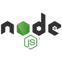

## 
.png )

### Developer | THARU - Creator of **DevFlex™️**

---

Welcome to my GitHub profile! 🚀 I'm passionate about creating flexible and high-quality solutions using **JavaScript**. My expertise includes developing:

- 🛠 **APIs**
- 🤖 **Telegram Bots**
- 💻 **Web Design & Development**
- 📱 **App Development**
- 🧩 **Software Solutions**

---

### 🌱 Currently working on:
- New and exciting **JavaScript projects**
- Innovative **bots** and **web apps**

---

### 🚀 What I do at **DevFlex™️**:
I bring coding ideas to life, with a focus on flexibility and functionality in every project. Whether it's building complex APIs or designing intuitive interfaces, I'm always ready to tackle new challenges.

---

### 💻 Programming Languages:

  

     

 
 
&nbsp;    
 

  
 

---

### 💡 Let's Connect:

  
  
  

---

### ⚡ Fun Fact:
When I’m not coding, you’ll find me exploring new tech trends or learning something new to up my development game!

---

**"Flexibility in Every Function" — DevFlex™️**
